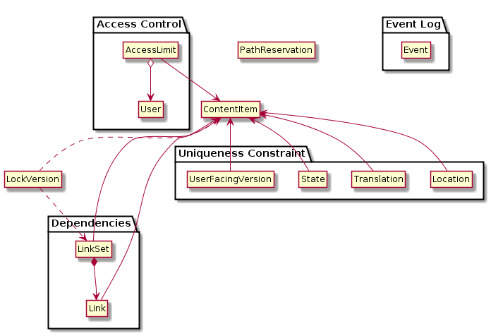
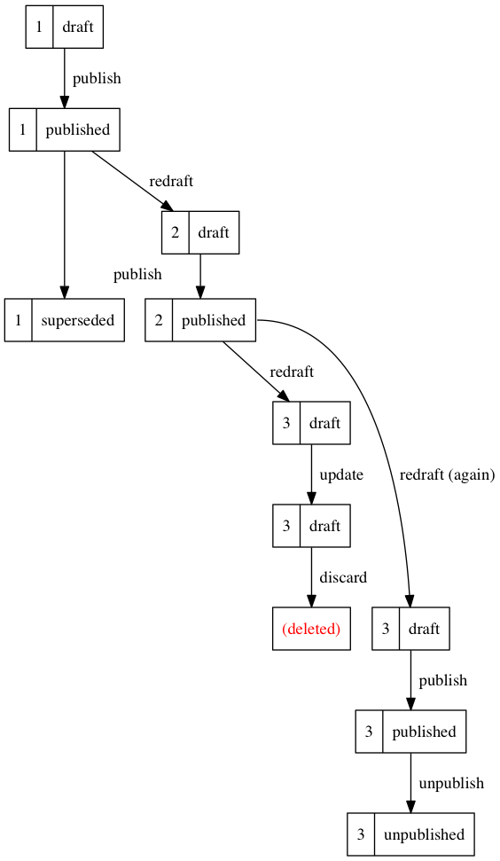

## Explanation of Publishing API's Object Model

This document outlines Publishing API's Object Model in moderate detail and
explains some of the design decisions and business needs for it.

## User Need

We based this object model on the needs of our users. In the Publishing Platform
team, we are in a unique position such that the majority of our users are in
fact other developers working on their respective publishing applications.

In summary, this object model aims to address the following needs:

- Enable *dependency resolution* work. Specifically, this includes the ability
to support features such as Govspeak, Related Links and Breadcrumbs

- Enable *historical editions* by preserving historical versions of content
items (not just the latest draft/published)

In addition to these user needs, we also aim to:

- Reduce complexity in the system. Specifically, we'd like to separate out
concepts where appropriate and reduce duplication (previously we had separate
models for draft and live content items)

- Improve flexibility by moving towards a model that caters for changing
requirements without requiring significant re-writes of application code

## High-level Diagram

The following is a high-level diagram that was generated with
[plantuml](http://plantuml.com/plantuml/). The source that generated this diagram is
checked into this repository.

## General Themes

You can see that ContentItem is central to the app's object model. The majority
of models within the app relate to ContentItem in some way. This shouldn't be
surprising as the Publishing API's core responsibility is to provide workflow
as a service for managing content.

Note that all of the arrows are pointing inwards to ContentItem and not the
other way around. This indicates that these models have visibility of the
ContentItem whereas ContentItem is shielded from the complexity of these
models. This improves extensibility as new concepts can be added without having
to re-open ContentItem to add new behaviour. See the
[open/closed principle](https://en.wikipedia.org/wiki/Open/closed_principle) for
more explanation of this approach.

Consider the alternative where all of this information resides in fields on the
ContentItem. If this were the case, we'd have to repeatedly update this model
when almost any piece of business logic changes within the app. If the
ContentItem has multiple responsibilities, this could be made more difficult as
this class would be significantly more complicated. By breaking distinct
concepts into separate models, it is easier to reason about a specific piece of
business logic.

An example of a model that has a large number of responsibilities is
[Edition](https://github.com/alphagov/whitehall/blob/master/app/models/edition.rb)
in the Whitehall application. This has become a
[God object](https://en.wikipedia.org/wiki/God_object) that is arguably quite
difficult to work with.

## Content Item Uniqueness

The ContentItem model is a simple model that houses content. It is surrounded by
objects that determine:

- The locale of the content (Translation)
- The base_path of the content (Location)
- The workflow state of the content (State)
- The user-facing version of the content (UserFacingVersion)

ContentItems are unique with regard to these surrounding objects. What this
means is that no two pieces of content can be in the same locale at the same
base_path in the same workflow state with the same user-facing version.

By making this an invariant of the system, we can build our workflow with this
in mind. For example, when publishing a piece of content, we change the workflow
state from *draft* to *published*. If there is already a content item occupying
that base path in a published state, we must consider how the system should
behave. By stating what these invariants are, it is easier to reason through
edge cases of behaviour in the system.

## Lock Version

The lock version exists to prevent destructive changes being made to data when
multiple people are editing the same piece of content at the same time. It does
this by tracking a system-level version for arbitrary models in the domain.
Currently, we make use of lock versions for content items and link sets.

The lock version differs from the user-facing version in that it is an internal
system version that is not intended to be shown to a user. Instead, it forms
part contract between publishing apps and the Publishing API. It is not
mandatory that publishing apps make use of the lock version feature, but it is
strongly recommended that they do to prevent losses to work.

You can read more about lock versions
[here](https://github.com/alphagov/publishing-api/blob/master/doc/publishing-api-syntactic-usage.md).

## User-Facing Version

The user-facing version, as the name implies, is the version for a piece of
content that is visible to users in publishing applications. This number changes
as a result of the user re-drafting a piece of content and it stays the same as
the content item transitions between states such as *draft* and *published*.

Longer term, we intend to use this model to support the user need related to
historical versions of content items. The object model is flexible enough to
support retrieval of older versions of content. Currently, there's no mechanism
to get these older pieces of content, but this could be added in time.

## Workflow

The following is a workflow diagram that was generated with
[graphviz](http://www.webgraphviz.com/). It shows how a content item's
user-facing version and state transition as actions are performed on it. The
source that generated this diagram is checked into this repository.

